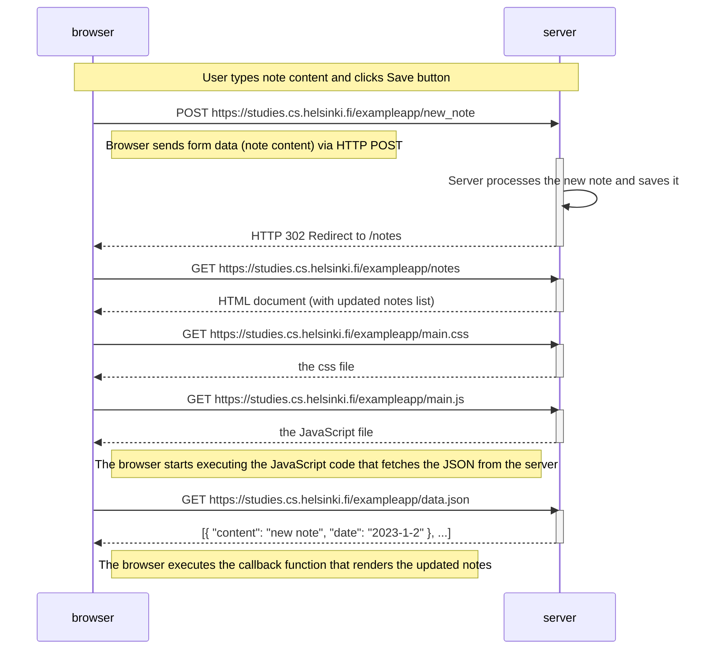

# Exercise 0.4: New note diagram

Sequence diagram showing the flow when a user creates a new note by filling the text field and clicking Save.

```mermaid
sequenceDiagram
    participant browser
    participant server

    Note over browser,server: User types note content and clicks Save button
    
    browser->>server: POST https://studies.cs.helsinki.fi/exampleapp/new_note
    Note right of browser: Browser sends form data (note content) via HTTP POST
    
    activate server
    server->>server: Server processes the new note and saves it
    server-->>browser: HTTP 302 Redirect to /notes
    deactivate server

    browser->>server: GET https://studies.cs.helsinki.fi/exampleapp/notes
    activate server
    server-->>browser: HTML document (with updated notes list)
    deactivate server

    browser->>server: GET https://studies.cs.helsinki.fi/exampleapp/main.css
    activate server
    server-->>browser: the css file
    deactivate server

    browser->>server: GET https://studies.cs.helsinki.fi/exampleapp/main.js
    activate server
    server-->>browser: the JavaScript file
    deactivate server

    Note right of browser: The browser starts executing the JavaScript code that fetches the JSON from the server

    browser->>server: GET https://studies.cs.helsinki.fi/exampleapp/data.json
    activate server
    server-->>browser: [{ "content": "new note", "date": "2023-1-2" }, ...]
    deactivate server

    Note right of browser: The browser executes the callback function that renders the updated notes
```
