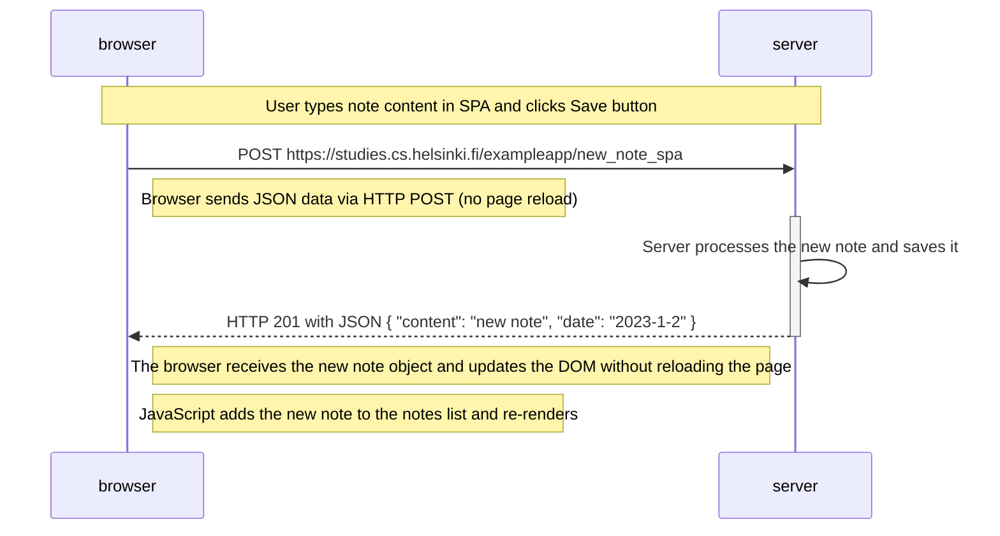

# Exercise 0.6: New note in Single page app diagram

Sequence diagram showing the flow when a user creates a new note using the single-page app version.

```mermaid
sequenceDiagram
    participant browser
    participant server

    Note over browser,server: User types note content in SPA and clicks Save button
    
    browser->>server: POST https://studies.cs.helsinki.fi/exampleapp/new_note_spa
    Note right of browser: Browser sends JSON data via HTTP POST (no page reload)
    
    activate server
    server->>server: Server processes the new note and saves it
    server-->>browser: HTTP 201 with JSON { "content": "new note", "date": "2023-1-2" }
    deactivate server

    Note right of browser: The browser receives the new note object and updates the DOM without reloading the page
    Note right of browser: JavaScript adds the new note to the notes list and re-renders
```
